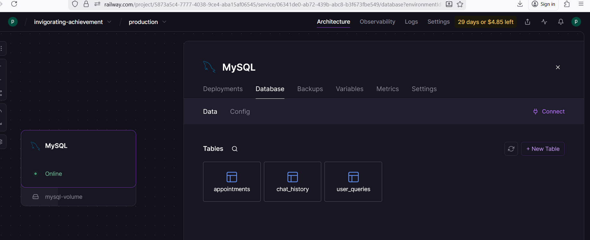
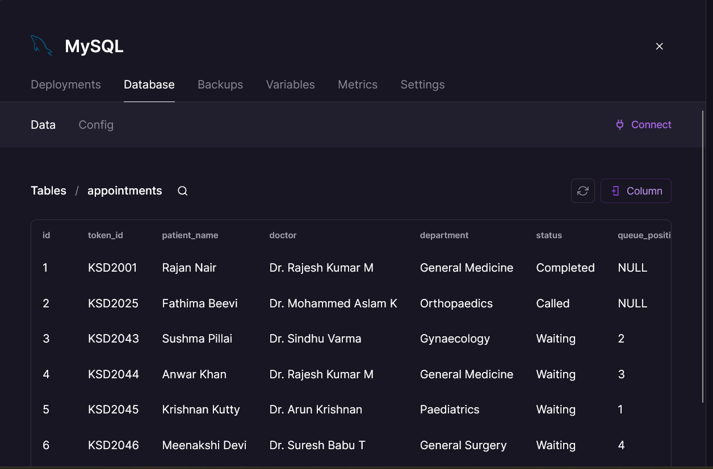
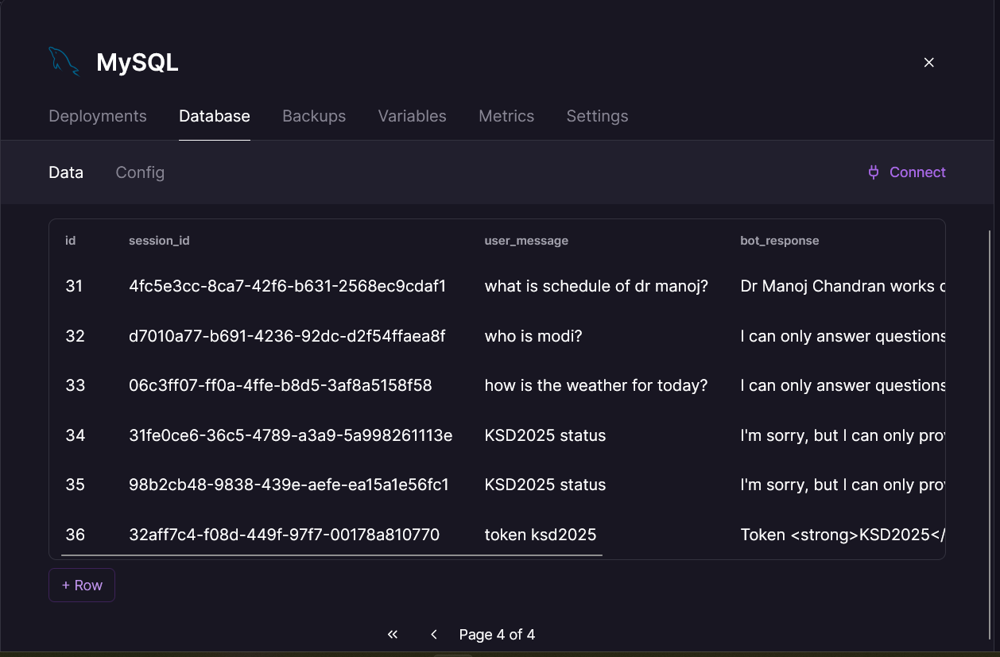
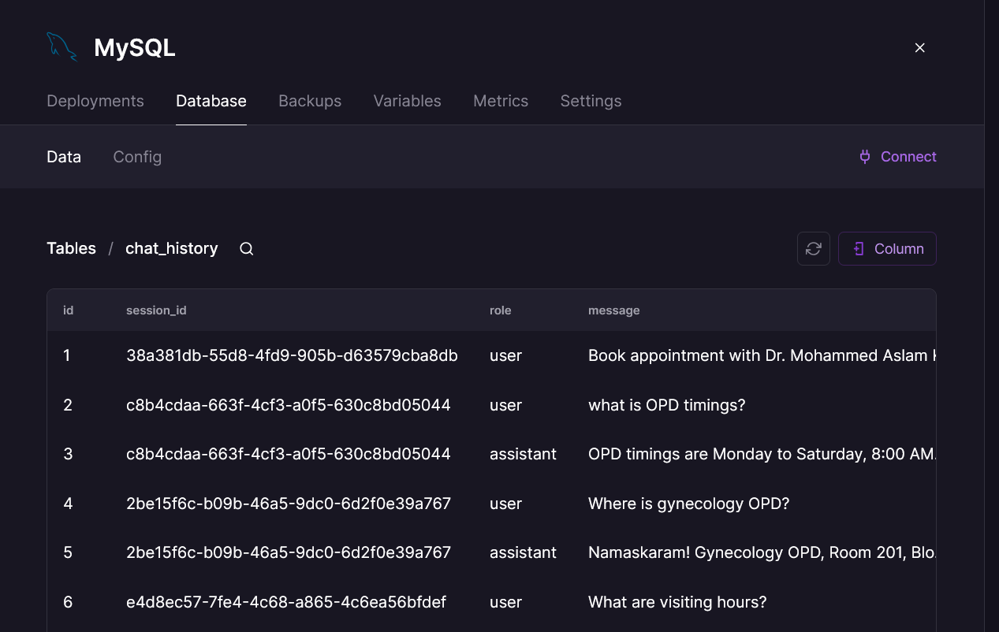

# 🏥 DGH Kasaragod — AI Hospital Chatbot

An AI-powered chatbot for District General Hospital Kasaragod, 
Kerala Government. Built with FastAPI, RAG pipeline, 
Gemini LLM with local Ollama fallback, and MySQL database.


---

## ✨ Features

- RAG pipeline — answers strictly from hospital documents
- 3-tier LLM fallback: Gemini → Ollama phi3:mini → Rule-based
- Live token status from MySQL database
- 5-page responsive frontend (Kerala Govt theme)
- Chat history stored in database
- Strict mode — refuses off-topic questions

---

## 🏗️ Architecture
```
User → HTML Frontend → FastAPI Backend
                           ↓
                    Token? → MySQL lookup
                           ↓
                    RAG Pipeline (numpy vectors)
                           ↓
                    Gemini 2.0 Flash (primary)
                           ↓ fails
                    Ollama phi3:mini (fallback)
                           ↓ fails
                    Rule-based (emergency)
```

---

## 🧠 RAG Pipeline

1. Documents ingested: 2 PDFs + 1 CSV
2. Text chunked into 80-word overlapping segments
3. Embedded using sentence-transformers (all-MiniLM-L6-v2)
4. Stored as pure numpy vectors — no C++ dependencies
5. Cosine similarity search retrieves top 3 relevant chunks
6. Chunks injected into LLM system prompt
7. LLM answers ONLY from retrieved context

---

## 🗄️ Database Schema (MySQL — Railway)

| Table | Purpose |
|---|---|
| appointments | Token ID, patient, doctor, status, queue |
| user_queries | Every message + bot response logged |
| chat_history | Full conversation by session ID |

---

## 📸 Database Screenshots







---

## 🤖 LLM Strategy

| Priority | Provider | When Used |
|---|---|---|
| 1st | Gemini 2.0 Flash | Primary — best quality |
| 2nd | Ollama phi3:mini | Gemini quota exceeded |
| 3rd | Rule-based | Both LLMs unavailable |

> Note: Ollama fallback works in local deployment.
> For cloud deployment, fallback is rule-based.
> In production, Ollama would run on the same server.

---

## ⚙️ Setup

### 1. Clone repository
```
git clone https://github.com/yourusername/dgh-kasaragod-chatbot
cd dgh-kasaragod-chatbot
```

### 2. Create virtual environment
```
python -m venv venv
venv\Scripts\activate
```

### 3. Install dependencies
```
pip install -r requirements.txt
```

### 4. Configure environment
```
cp .env.example .env
# Add your GEMINI_API_KEY and DB credentials to .env
```

### 5. Setup database
```
cd backend
python -c "from database.models import create_tables; create_tables()"
```

### 6. Build RAG index
```
python -c "from rag.ingest import ingest_all; ingest_all()"
```

### 7. Run backend
```
python -m uvicorn main:app --reload
```

### 8. Open frontend
```
Open frontend/index.html in browser
```

---

## 📁 Project Structure
```
dgh-kasaragod-chatbot/
├── frontend/
│   ├── index.html      # Homepage + chatbot + token checker
│   ├── doctors.html    # Doctor cards with department filter
│   ├── services.html   # Hospital services
│   ├── faq.html        # Accordion FAQ
│   └── contact.html    # Contact + emergency numbers
├── backend/
│   ├── main.py         # FastAPI app
│   ├── routes/
│   │   ├── chat.py     # Chat endpoint with token detection
│   │   └── status.py   # Token status endpoint
│   ├── rag/
│   │   └── ingest.py   # RAG pipeline (pure numpy)
│   ├── services/
│   │   └── llm_service.py  # 3-tier LLM fallback
│   └── database/
│       └── models.py   # MySQL operations
├── documents/
│   ├── hospital_policy.pdf
│   ├── patient_guide.pdf
│   └── doctor_schedule.csv
├── Screenshots/        # Database & UI screenshots
├── .env.example        # Environment template
├── requirements.txt    # Python dependencies
├── CHALLENGES.md       # Problems faced & solutions
└── README.md
```

---

## 🧪 Test Cases

| Query | Expected Response |
|---|---|
| "What are OPD timings?" | Mon-Sat 8AM-1PM |
| "Where is gynecology OPD?" | Room 201, Block A |
| "Check token KSD2045" | Live patient data |
| "What are visiting hours?" | 4PM-6PM daily |
| "Who is the Prime Minister?" | Politely refuses |
| "Emergency number?" | 108 / 04994-220332 |

---

## 🔧 Challenges & Solutions

See [CHALLENGES.md](CHALLENGES.md) for detailed documentation 
of 10 technical challenges faced and how they were solved.

